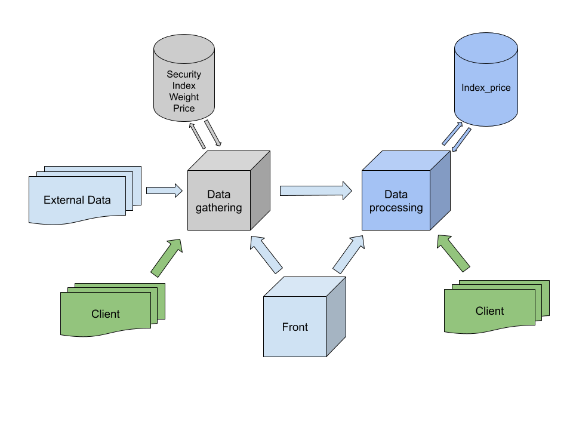

# Design and Implementation of a Securities solution
In this project I have drawn and implemented a Django solution that receive securities data from "external sources" and it calculates and shares information related to indexes.


## Design of the architecture


#### Services
I would use a microservice arquitecture.

###### Data gathering
This service has the aim of retrieving data from external sources and store them in a database. The datas that are stored are very related. For that reason I would use a SQL database like PostgreSQL. To manage all of that I would use the Django framework because its ORM helps a lot to handle all of that.

###### Data processing
The purpose of this service is to calculate and store finalcial indicators like the synthetic index. In this example I only save this indicator but, it could be possible that there are more indicators related to it, because of that I would use a PostgreSQL database too. I would use the Django framework here just to simplify the building of the whole application (use the same framework in both services), but this is not mandatory.

###### Frontend service
The frontend service is the data visualization tool. 
However, the other services are APIs. Because of that clients could fetch the datas without a "good looking" maner. It could be implemented with any framework but I would choose Vue.


#### Interaction
The data gathering service receives data from external sources and store them. That behavior should trigger the task of sending the new information to the data processing service (with the datas that it needs).
With the new information and the one stored in the data processing database the data processing service should calculate the new indicator. After that, it should store the new data in the database and send it to the frontend service (or the clients that are connected).

Due to clients must receive the actualized datas on real-time they should connect via WebSocket to the data processing service. To manage the huge amount of information and to make a Pub-Sub patron I would use Redis.


## Implementation
Due to I do not have enough knowledge and experience in microservices and sockets I finaly implemented like a monolithic service.
I used Django to build it and the Channels package to connect via WebSocket. The fake external data and the clients are implemented in the same file (externalData.html).


## How to run it
###### Run the postgrest conatiner:
```
docker-compose up
```

###### Load initial data
```
python manage.py loaddata initialData.json
```
It will populate the database with the datas specified in securitiesManager/fixtures/initialData.json


###### Run the server
```
python manage.py runserver
```


###### Connect 
Open the externalData.html file in a browser. It will be the external data source and the client too.


## How it works
When externalData.html is open it runs a setInterval function that send a new price of a security every 10 seconds.
The server will search for that security in order to find the index that it belongs to. For these indexes it calculates and stores their new prices and it sends them to the clients thanks to Channels package.
When the client receives the new prices it shows them.


## Problems
As I mentioned before, my few knowledge in microservices did not allow me to implement it as I spected. In addition, I was not able to deal with Channels Layer to implement a Pub-Sub channel.


## Considerations
Please, omit the style and script tags inside the html, it is a bad practice. As the frontend part was not the main purpose of this exercise I did this in order to simplify the frontend development.